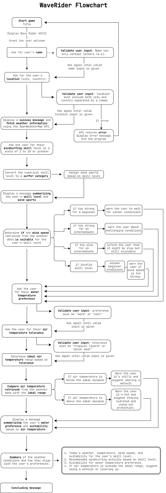

# WAVERIDER

Visit the live deployed site: [WaveRider](https://wave-rider-fd4d233c3f5b.herokuapp.com/)

This project is my third student project.

## ABOUT WAVERIDER

"Wave Rider" offers a fun journey into the world of windsurfing, providing a personalized experience that caters to users' unique preferences and skills. The game dynamically adjusts to the users' skill level, ensuring an engaging adventure for all.
Read more about the game in the Features section.

## CONTENTS

* [Flowchart](#flowchart)

* [User Experience](#user-experience-ux)

* [User Stories](#user-stories)

* [Features](#features)  
  * [Existing Features](#existing-features)
  * [Future Implementations](#future-implementations)
  * [Defensive Programming](#defensive-programming)

* [Technologies Used](#technologies-used)
  * [Languages Used](#languages-used)
  * [Frameworks, Libraries, Programs & Imports Used](#frameworks-libraries--programs-used-imports)

* [Deployment & Local Development](#deployment--local-development)
  * [Deployment](#deployment)
  * [Local Development](#local-development)
    * [How to Fork](#how-to-fork)
    * [How to Clone](#how-to-clone)

* [Testing](#testing)

* [Credits](#credits)
  * [Code Used](#code-used)
  * [Content & Media](#content-media)  
  * [Acknowledgments](#acknowledgments)

- - -

## Flowchart

To follow best practice, a flowchart was created for the game's logic, using a free version of [Draw.io](https://www.draw.io).

The flowchart below illustrates the sequential steps of the WaveRider program, depicting how the user can navigate through it and the available options at each stage.

- - -

## User Experience (UX)

I wanted to create a game that is engaging, informative, and user-friendly.
I wanted the game to help windsurfing enthusiasts of all skill levels and provide a personalized and engaging experience from start to finish.

* Welcome and Introduction:
Upon starting the game, users are greeted with a warm welcome message and an eye-catching ASCII art title ("Wave Rider"), setting the tone for an exciting windsurfing adventure.

* Personalization:
The game begins by prompting users to enter their name and location, allowing for a personalized experience. User inputs are validated to ensure correctness.

* Interactive Dialogue:
Users engage in interactive dialogue throughout the game, responding to prompts and making choices regarding their windsurfing skill level, temperature preferences, and more.

* Feedback and Guidance:
The game provides feedback and guidance tailored to the user's inputs. For example, users receive encouragement based on their chosen skill level and recommendations regarding wind and temperature suitability for windsurfing.

* Visual Presentation:
Visual elements such as ASCII art and centered statement printing enhance the visual appeal of the game, making it visually engaging and easy to follow.

* Information Accessibility:
Important information such as weather data and user preferences are presented clearly and succinctly, ensuring easy comprehension and accessibility.

* Progressive Disclosure:
The game unfolds gradually, revealing information and options in a progressive manner. Users are guided step-by-step through the windsurfing assessment process, preventing information overload.

* Conclusion and Well Wishes:
The game concludes with a positive message, wishing users a fantastic time conquering the waves. This conclusion leaves users with a sense of satisfaction and anticipation for their windsurfing adventure.

- - -

## User Stories

### First Time Visitor Goals

* As a first-time visitor, I want to see a captivating welcome message that showcases the game's purpose and excites me to play.
* As a first-time visitor, I want clear and concise instructions to guide me through the game's mechanics and features.
* As a first-time visitor, I want the game to be visually appealing and easy to navigate through.

### Returning and frequent Visitor Goals

* As a returning visitor, I want the game to remember my skill level and location from previous sessions for a more personalized experience.
* As a returning visitor, I want to see new challenges or scenarios to keep the gameplay engaging and dynamic.
* As a frequent visitor, I want the option to track my windsurfing progress and achievements within the game.

- - -

## Features

### Existing Features

Τhe game simulates a conversation between a windsurfer and a digital companion named Wave Rider. 
Here are the existing features:

* Welcome message and user input:
    * The program welcomes the user and asks for their name and location.
    * It validates the user's input to ensure it consists only of letters (for name) and separates city and country with a comma (for location).

* Skill level determination:
    * The program asks the user about their windsurfing skill level on a scale of 1 to 10.
    * Based on the user's input, it categorizes them as a "Chill Surfer," "Freestyle Flyer," "Wave Slayer," or "Legendary Windsurfer."
    * It also suggests windsurfing styles (cruising, freestyle maneuvers, catching waves) suitable for their skill level.

* Weather data retrieval:
    * The program uses an API key to fetch weather data (weather type, temperature, wind speed) for the user's location from [Open Weather Map](https://openweathermap.org/)

* Suitability assessment:
    * The program asks the user about their water temperature preference and air temperature tolerance.
    * It compares the user's preferences with the retrieved weather data to determine if the conditions are suitable for windsurfing.

* Summary and recommendations:
    * The program summarizes the user's preferences, windsurfing skill level, and weather data.
    * It provides recommendations on windsurfing styles (based on skill level) and suggests if a wetsuit might be necessary (based on air temperature).

* Ending message:
    * The program concludes the interaction with a goodbye message and encourages the user to enjoy their windsurfing experience.

### Future Implementations

In future implementations I would like to:

* Add gear recommendations:
Based on the user's skill level, windsurfing style (chosen or suggested), weather conditions, and water temperature preferences, the program could recommend specific windsurfing gear (board size, sail size, wetsuit type) to optimize their experience.

* Add spot recommendation:
Based on the user's skill level, windsurfing style preference and weather data, the program could recommend nearby windsurfing spots. This could involve e.g. integrating with a database of windsurfing locations.

* Interactive tutorial selection:
Depending on the user's chosen windsurfing style (cruising, freestyle maneuvers, catching waves), provide short interactive tutorials with text, animations, or even links to video demonstrations. This would help beginners improve their technique or allow experienced surfers to learn new tricks.

### Defensive Programming

This program incorporates several defensive programming features to improve its robustness and handle unexpected user input. For more extended description, go to [TESTING.md](TESTING.md) in the Full Testing section.
Here are some key examples:

`1. Input Validation`
Ensures user input conforms to expected format.
Some examples:

* Name validation, welcome_user():
  * Accepts only alphabetical characters(.isalpha()) 
  * Provides informative error messages using ValueError exceptions

* Location validation, welcome_user(): 
  * Uses API to confirm valid city (requests.get)
  * Checks if the user entered both city and country separated by a comma using if "," not in location
  * Validates the number of commas to prevent extra entries
  * Uses a try-except block to catch potential errors and provide informative messages to the user
  * Attempts to split the location string by comma to extract city and country

* Windsurfing Skill Level Validation, windsurfing_skill():   
  * Converts the entered skill level to an integer using int(input())
  * Assigns skill levels ("Chill Surfer", "Freestyle Flyer", "Wave Slayer", "Legendary Windsurfer") based on the numerical input using a series of if-elif statements
  * Handles invalid numerical input by providing an informative message

`2. Error handling`
Handles potential errors during program execution.
Some examples:

* API Request Handling, get_weather_data():
  * Uses a try-except block to catch potential errors during the API request.
  * Checks the API response code (response['cod']) to identify successful requests (code 200) and handles unsuccessful requests by printing an error message.
* The code uses try-except blocks in various functions to catch potential errors during user input, API calls, and data manipulation. It provides informative error messages to the user and avoids program crashes.

`3. Data filtering`
Ensures data types are as expected to prevent unexpected behavior.
Some examples:

* Weather Data Extraction, get_weather_data():
  * Extracts only relevant weather information (weather, temperature, feels_like, wind_speed) from the API response assuming successful request.
  * The windsurfing_skill function uses conditional statements to categorize the user's skill level based on the numerical input and creates a list of windsurfing styles based on the category. This ensures proper handling of the skill level throughout the program.
  * The is_suitable_wind_speed function uses different messages depending on the skill level and wind speed. It also includes a default case to handle unexpected skill level values.

`4. Feedback mechanisms`
Throughout the program, different functions provide informative messages to the user, explaining what the program is doing, what input is expected, and offering guidance.
Some examples:

* Clarification Prompts:
  * In the welcome_user() function, if the user enters a location that doesn't include a comma, the program prompts them again with an explanation of the expected format ("City, Country").

* Error Messages with Guidance:
  * When the program encounters an error fetching weather data for the user's location, it doesn't just display a generic error message. Instead, it informs the user that the location might be misspelled and suggests they try again.

`5.	Modular design`
The code is organized into functions, each responsible for a specific task. This modular design enhances readability, maintainability, and allows for easier troubleshooting.
For more thorough description of the functions, see Full Testing section in the [TESTING.md](TESTING.md)

`6.	General robust logic`
The program employs robust logic to handle diverse scenarios.

* API interaction
* Flexible input handling
* Adaptive recommendations
* Error Reporting and Logging
* Modular and Testable Code

- - -

## Technologies Used

### Languages Used

Python was used for the back-end programming.

### Frameworks, Libraries, Programs & Imports Used

* [Git](https://git-scm.com): Used for version control (`git add`, `git commit`, `git push`)
* [Github](https://github.com/): To save and store the files for the website.
* [GitPod](https://gitpod.io/) - Cloud-based IDE used to code.
* [Heroku](https://www.heroku.com) used for hosting the deployed back-end site.
* [Draw.io](https://www.draw.io) - To create a flowchart for the game's logic.

I've used the following Python packages and external imported packages:

* `requests`: used to fetch weather data from the api.
* `time`: used for adding time delays.
* `math`: used to round the digits for the feels_like variable.
* `pyfiglet`: used for the ASCII text.
* `fontstyle`: used to add colours, font weights and other styles to the terminal text.

- - -

## Deployment & Local Development

### Deployment

Visit the live deployed site: [WaveRider](https://wave-rider-fd4d233c3f5b.herokuapp.com/)

This project was deployed using the Code Institute's mock terminal for Heroku.

These steps were taken for the deployment:

1. Create an account or log in to Heroku.
2. On the dashboard, in the right corner click the button that says "New" and choose "Create New App".
3. Pick a name of the app. The name has to be unique because it can't match any other name being used.
4. Select your region, United States or Europe.
5. Add payment method if needed.
6. Click "Create App".
7. On the menu at the top of the page, go to the Settings Tab.
8. Scroll down to Config Vars and click "Reveal Config Vars".
9. Add a new Config Var and enter PORT in the keybox and 8000 in the valuebox.
10. Under Config Vars you will find Buildpacks.
11. Click "Add Buildpacks".
12. Select python.
13. Repeat this step but select nodejs.
14. Important to know: The python has to be picked before the nodejs, if it is not in order 6you can change the order by click and drag to correct the order.
15. Scroll back to the top of the page, to the menu and go to the Deploy Tab.
16. Select GitHub as the deployment method and confirm.
17. Search for you repository name and connect that.
18. Scroll down to the bottom of the page and there you can choose if you want the deploys to be Automatic or Manually. The Manually deployed branches needs redepolying each time the repository is updated.
19. Click "View" to see the live site.

### Local Development

#### How to Fork

To fork the repository:

1. Log in (or sign up) to Github.
2. Go to the repository for this project, [KikiBerg/WaveRider](https://github.com/KikiBerg/WaveRider)
3. Click the Fork button in the top right corner.

#### How to Clone

To clone the repository:

1. Log in (or sign up) to GitHub.
2. Go to the repository for this project, [KikiBerg/WaveRider](https://github.com/KikiBerg/WaveRider)
3. Click on the code button, select whether you would like to clone with HTTPS, SSH or GitHub CLI and copy the link shown.
4. Open the terminal in your code editor and change the current working directory to the location you want to use for the cloned directory.
5. Type 'git clone' into the terminal and then paste the link you copied in step 3. Press enter.

- - -

## Testing

Please refer to [TESTING.md](TESTING.md) file for all testing carried out.

- - -

## Credits

### Code Used

* The idea for the project came from my partner, who is a windsurfing enthusiast. The code was solely initiated in my brain!
* I got help from [stackoverflow](https://stackoverflow.com/questions/23623288/print-full-ascii-art) as the ascii art was not showing without the r in the beginning.
* I looked at this [tutorial](https://www.youtube.com/watch?v=_jBeFdqnNAU&ab_channel=TechNotebook) to understand how I get an API key and where in the code I should enter the API endpoint URL in order to validate the data I wanted to fetch.

### Content & Media

* All the text content was written by myself. 
* I got help from [chatgpt](chat.openai.com/) to generate funnier comments than the ones I'd initially written myself.
* I used this [ascii art](https://www.asciiart.eu/sports-and-outdoors/surfing) for the end of the game.

### Acknowledgments

I would like to acknowledge the following people:

* The Tutor support from Code Institute for assisting and explaining. Thanks a bunch!
* My fellow co-student [Gudrun](https://github.com/g-omarsdottir) for reviewing and testing!
* My fellow co-student [Efi](https://github.com/EfthymiaKakoulidou) for helping me out with my Heroku issues!
* My fellow co-student [Darrach](https://github.com/DarrachBarneveld) for testing and trying to break my code!
* Sheryl Goldberg - My Code Institute Mentor. Huge thanks for your time and support!

- - -