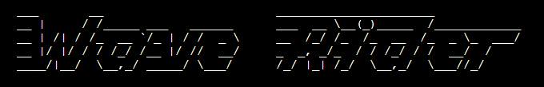

# WAVERIDER

Visit the live deployed site: [WaveRider](https://wave-rider-fd4d233c3f5b.herokuapp.com/)

This project is my third student project.

# ABOUT WAVERIDER

"Wave Rider" offers a fun journey into the world of windsurfing, providing a personalized experience that caters to users' unique preferences and skills. The game dynamically adjusts to the users' skill level, ensuring an engaging adventure for all.

## CONTENTS

* [User Experience](#user-experience-ux)

* [User Stories](#user-stories)

* [Features](#features)  
  * [Features](#features)
    * [feature-01](#feature-01)
    * [feature-02](#feature-02)
    * [feature-03](#feature-03)
    * [feature-04](#feature-04)
  * [Future Implementations](#future-implementations) 

* [Technologies Used](#technologies-used)
  * [Languages Used](#languages-used)
  * [Frameworks, Libraries & Programs Used](#frameworks-libraries--programs-used)

* [Deployment & Local Development](#deployment--local-development)
  * [Deployment](#deployment)
  * [Local Development](#local-development)
    * [How to Fork](#how-to-fork)
    * [How to Clone](#how-to-clone)

* [Testing](#testing)

* [Credits](#credits)
  * [Code Used](#code-used)
  * [Content](#content)
  * [Media](#media)
  * [Acknowledgments](#acknowledgments)

- - -