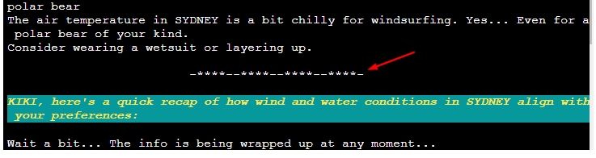

# WAVERIDER

Visit the live deployed site: [WaveRider](https://wave-rider-fd4d233c3f5b.herokuapp.com/)

Return back to the [README.md](README.md) file.

- - -

## CONTENTS

* [AUTOMATED TESTING](#automated-testing)
  * [PEP8 CI Validator](#validator)
  * [Lighthouse](#lighthouse)
  * [Responsiveness](#responsiveness)
  * [Browser Compatibility](#browser-compatibility)

* [MANUAL TESTING](#manual-testing)
  * [Testing User Stories](#testing-user-stories)
  * [Full Testing](#full-testing)

* [BUGS](#bugs)

- - -

## AUTOMATED TESTING

#### PEP8 CI Validator

[PEP8 CI Validator](https://pep8ci.herokuapp.com) was used to validate my run.py file.

File | CI URL | Screenshot | Notes |
| --- | --- | --- | --- |
| run.py | [PEP8 CI Validator](https://pep8ci.herokuapp.com)|  | Passed. No warnings or errors |

- - -

#### Lighthouse

I used Lighthouse within the Chrome Developer Tools to test the performance, accessibility, best practices and SEO of the website.
I tested only for Desktop results.

`Deployed Site`

| Site | Desktop | Notes |
| --- | --- | --- |
|[WaveRider](https://wave-rider-fd4d233c3f5b.herokuapp.com/) |  | Some minor warnings that I ignored. |

- - -

#### Responsiveness

I have not tested my deployed project on multiple devices to check for responsiveness issues.
The template is given by CI and I did not make any further changes apart from adding some padding round the terminal window.

- - -

#### Browser Compatibility

I have tested my deployed project on two different browsers to check for compatibility issues. I could not find any issues.

| Browser | Main page |
| --- | --- |
| Chrome |  | 
| Edge |  | 

- - -

## MANUAL TESTING

#### Testing User Stories

`First Time Visitors`

| Goals | How are they achieved? |
| :--- | :--- |
| I want to see a captivating welcome message that showcases the game's purpose and excites me to play. | Achieved through the wave_rider_ascii function that displays an ASCII art logo and the welcome_user function that greets the user with styled text. |
| I want clear and concise instructions to guide me through the game's mechanics and features. | Achieved through structured and user-friendly prompts guiding the player. |
| I want the game to be visually appealing and easy to navigate through | Achieved through formatted text using the fontstyle library for greetings and prompts, making the text visually appealing. The code structure with clear function calls makes navigation easier. |

`Returning and Frequent Visitors`

|  Goals | How could they be achieved? |
| :--- | :--- |
| I want the game to remember my skill level and location from previous sessions for a more personalized experience. | Comments in the welcome_user function and windsurfing_skill function for future storage of this data. |
| I want to see new challenges or scenarios to keep the gameplay engaging and dynamic. | The game could be expanded to offer different challenges based on location or weather conditions. |
| I want the option to track my windsurfing progress and achievements within the game. | Similar to remembering user data, features for tracking progress and achievements could be added. Additional functionalities e.g. user accounts and/or databases. |

- - -

#### Full Testing

Full testing was performed on the following devices:

* DESKTOP-24171KO
* Display: Apple 27" LED Cinema

| Feature | Expected Outcome | Testing Performed | Result | Pass/Fail | Screenshot |
| --- | --- | --- | --- | --- | --- |
| 01 `wave_rider_ascii()` | Displays "WaveRider" ascii art | Visual inspection | Art displayed as expected | Pass |  |
| 02 `welcome_user()` | Greets the user, asks for name and location, validates input | User enters valid name and location (city, country) | User's name and location are captured correctly | Pass |  |
| 03 `windsurfing_skill()` | Asks the user for windsurfing skill level and suggests windsports based on response | User enters a skill level between 1 and 10 or greater. | User's skill level is captured and corresponding windsports are suggested | Pass |    |
| 04 `is_suitable_wind_speed()` | Determines suitability of wind speed for windsurfing based on user's skill level | - Test with beginner skill and high wind speed  - Test with intermediate skill and moderate wind speed  - Test with advanced skill and low wind speed | - Advice is given to wait for calmer conditions for beginners with high wind speed - Advice is given for intermediate windsurfers depending on wind speed - No restrictions are applied for legendary windsurfers | Pass |   |
| 05 `get_windsurfing_suitability()` | Asks for water and air temperature preferences, offers windsurfing suitability guidance | User enters water preference ("warm" or "cool") and air temperature tolerance ("tropical lizard" or "polar bear") | User's water preference and air temperature tolerance are captured, and windsurfing suitability advice is provided based on weather data and preferences | Pass |   |
| 06 `get_weather_data()`| Fetches weather data from OpenWeatherMap for the given location | - Test with a valid city and country  - Test with an invalid city and country | - Weather data is retrieved for the valid location - Error message is displayed for the invalid location | Pass |  |
| 07 `centered_statement()`| Prints a symbol statement centered within the terminal width | User observes the statement being centered within the terminal | The statement is centered as intended | Pass |  |
| 08 `main()`| Runs all program functions in sequence | User is guided through the program steps and receives a summary of wind and water conditions for windsurfing | The program executes as designed and presents a user-friendly experience | Pass |  |
| 09 `ending_text()`| Displays a concluding message | User observes the concluding message | The message is displayed as expected | Pass |  |

- - -

## BUGS

I haven't encountered any bugs that I'm aware of.